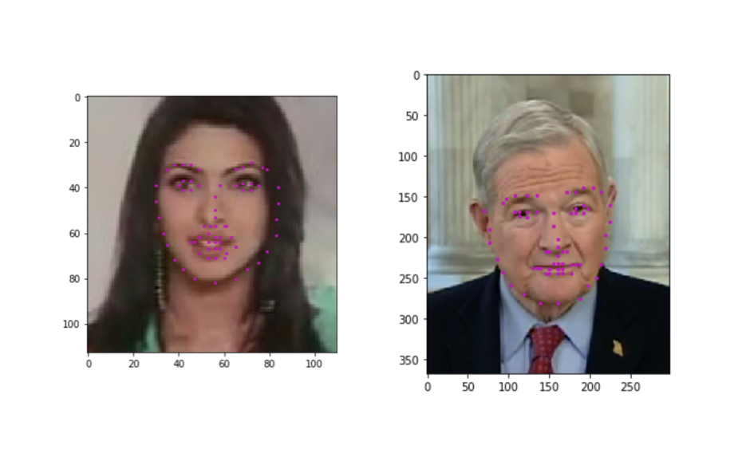

# First project of the Udacity Computer Vision Nanodegree
## Facial keypoint detection using a CNN

This project uses a CNN to predict 68 facial keypoints. Facial keypoints include points around the eyes, nose, and mouth on a face and are used in many applications. 

## Example

Below you can see an example of the position of the numbered keypoints.

 

The pretrained CNN was trained with the [YouTube faces DB](https://www.cs.tau.ac.il/~wolf/ytfaces/)
 
Here you can see two examples of the predicted  

 

## Code 

**- Notebook 1:** Loading and Visualizing the Facial Keypoint Data 

**- Notebook 2:** Defining and Training a Convolutional Neural Network (CNN) to Predict Facial Keypoints 

**- Notebook 3:** Facial Keypoint Detection Using Haar Cascades and your Trained CNN 

**- Notebook 4:** Fun Filters and Keypoint Uses 

## License

This project is licensed under the terms of the MIT license.
